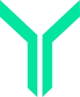
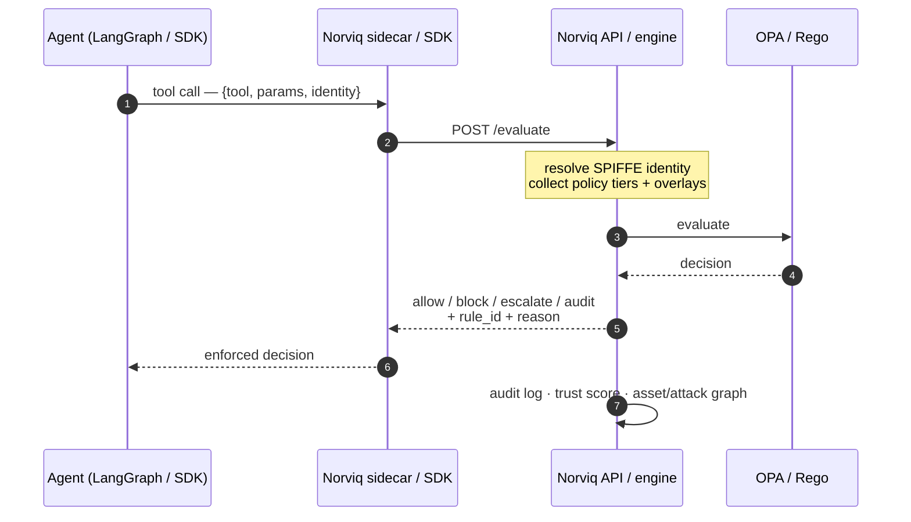
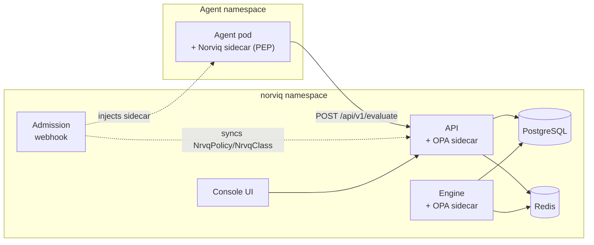

<div align="center">



# Norviq

**Runtime policy enforcement for LLM agent tool calls on Kubernetes.**

[](https://app.fossa.com/projects/git%2Bgithub.com%2Fnorviq-dev%2Fnorviq?ref=badge_shield&issueType=security)
[](LICENSE)
[](https://kubernetes.io)
[](https://www.openpolicyagent.org)
[](https://docs.norviq.dev)

**[Documentation](https://docs.norviq.dev)** · **[Website](https://norviq.dev)** · **[Getting started](https://docs.norviq.dev/getting-started/)**

</div>

Norviq is a policy enforcement point (PEP) that sits between an AI agent's reasoning loop and the
tools it can call. Every tool call is intercepted, evaluated against OPA/Rego policies scoped to the
workload's Kubernetes/SPIFFE identity, and then **allowed, blocked, escalated, or audited** — before
the tool runs. It turns "the model decided to call `execute_sql` / `send_email` / `shell`" from an
implicit trust into an enforced, per-identity, auditable decision.

---

## Why

LLM agents are given real tools — databases, shells, email, cloud APIs, internal services. The model
chooses which to call at runtime, and a single prompt injection or reasoning error can turn a benign
agent into an exfiltration or destruction path. Norviq puts a deterministic, policy-driven gate on
that surface, so a tool call only happens if an explicit policy for that agent's identity allows it.

## How it works

Every tool call takes a round trip through the engine before it executes:



- **Interception** — an injected sidecar (or the SDK) forwards each tool call to the engine's `/evaluate`.
- **Identity** — decisions are scoped to the calling workload's SPIFFE identity (SPIRE SVID), not a
  shared secret, so policy is per-agent-class and per-namespace.
- **Policy** — Rego policies are layered in tiers (agent-class → namespace baseline → cluster baseline)
  with tighten-only overlays; the most-restrictive matching rule wins.
- **Modes** — `block` (deny + reason), `escalate`, `audit` (log only / monitor mode), so you can roll
  out enforcement observably before turning it on.

### Deployed components



Both the API and the Engine evaluate **in-process** against their own OPA sidecar (one OPA per replica,
bound to `127.0.0.1`) — neither proxies to the other. In the default injection mode
(`webhook.injection.sidecarMode: proxy`) the injected sidecar POSTs every tool call to the central API,
so Postgres, Redis, and policy loading stay centralized and nothing is evaluated per-pod. The Engine
Deployment runs that same evaluator as a standalone cluster workload (`NRVQ_SIDECAR_MODE=embedded`,
exposed as `norviq-engine:8282`) for callers that want to evaluate without going through the API.

## Works with your agent framework

The sidecar above is zero-code-change. For in-process interception instead — no sidecar, your
own event loop — the SDK (`norviq/sdk/`) wraps the tool-calling point of these frameworks so a
block/escalate decision raises before the tool ever runs. See
**[docs/guides/integrating-agents.md](docs/guides/integrating-agents.md)** for setup and snippets.

- **LangChain** — `norviq.sdk.langchain.adapter.protect(tools, interceptor)`
- **LangGraph** — `norviq.sdk.langgraph.adapter.GuardedToolNode(tools, interceptor)`
- **CrewAI** — `norviq.sdk.crewai.adapter.protect(tools, interceptor)`
- **AutoGen** — `norviq.sdk.autogen.adapter.protect(tools, interceptor)`
- **Azure / Semantic Kernel** — `norviq.sdk.semantic_kernel.adapter.policy_filter(interceptor)`

**[`examples/chatbot/`](examples/chatbot/)** is a runnable LangChain/LangGraph chatbot (Groq) where a
real model decides the tool calls and Norviq blocks the dangerous ones before they run — with a
`Dockerfile` and `k8s/` manifests for running it in-cluster behind the injected sidecar.

## Features

- **Policy enforcement** — OPA/Rego evaluated per tool call, sub-second, fail-closed.
- **Kubernetes-native** — `NrvqPolicy` / `NrvqClass` / `NrvqConfig` CRDs, a mutating webhook that
  injects the enforcement sidecar, and a Helm chart.
- **Workload identity** — SPIFFE/SPIRE SVIDs (with a mock mode for non-SPIRE clusters).
- **Console UI** — policy catalog + editor, attack graph, asset graph, agent trust, audit stream.
- **Red-team suite** — built-in adversarial tests (prompt injection, encoding/nesting evasion, SQLi,
  PII/PCI exfil) that prove a policy actually blocks.
- **Compliance mapping** — MITRE ATLAS and OWASP LLM Top-10 coverage with generate-enforcing-policy
  remediation.
- **High availability** — multi-replica with cross-replica policy propagation and DB-authoritative
  deletes; HPA/PDB/anti-affinity for multi-node clusters.
- **Multi-cluster (fleet)** — signed policy-bundle distribution across a hub and spoke clusters.

## Quick start

**Prerequisites:** a Kubernetes cluster (1.30+), `kubectl`, and Helm 3.

```bash
git clone https://github.com/norviq-dev/norviq.git
cd norviq

# 1. Install the CRDs
kubectl apply -f helm/norviq/crds/

# 2. Install Norviq (pulls the public images from ghcr.io/norviq-dev by default)
kubectl create namespace norviq
helm install norviq ./helm/norviq -n norviq \
  --set 'policyQuotaNamespaces={default}' \
  --set config.dbSslMode=disable   # the bundled Postgres has no TLS; omit if you point at an external TLS DB
```

`policyQuotaNamespaces` is the list of tenant namespaces that will run agents — it is **required**, not
optional. The chart installs a fail-closed `strict` namespace baseline for each entry, so an empty list
fails the install by design rather than shipping a cluster with no baseline. Add every agent namespace
you plan to use.

The chart deploys the API, engine, console UI, mutating webhook, and bundled PostgreSQL + Redis + OPA.
Port-forward the console:

```bash
kubectl -n norviq port-forward svc/norviq-ui 8080:80
# open http://localhost:8080
```

Sign in as `admin`. The chart generates a random first password on install (it only uses a literal
password if you set `auth.adminPassword` yourself) — read it back, then change it when the console
prompts you:

```bash
kubectl get secret norviq-secrets -n norviq -o jsonpath='{.data.NRVQ_AUTH_ADMIN_PASSWORD}' | base64 -d
```

Sidecar injection ships **off** (`webhook.injection.enabled: false`). Turn it on, then label the same
namespaces you listed in `policyQuotaNamespaces` — the label alone does nothing until the webhook is
enabled:

```bash
helm upgrade norviq ./helm/norviq -n norviq --reuse-values --set webhook.injection.enabled=true
kubectl label namespace <your-agent-namespace> norviq-injection=enabled
```

Every new pod in a labeled namespace then gets the enforcement sidecar injected.

> Trying it locally? A single-node [kind](https://kind.sigs.k8s.io/) cluster is enough to evaluate
> everything except multi-node HA. See **[docs/getting-started.md](docs/getting-started.md)**.

## Documentation

Full documentation is at **[docs.norviq.dev](https://docs.norviq.dev)**:

- **[Getting started](https://docs.norviq.dev/getting-started/)** — install, first login, sidecar injection, first policy
- **[Concepts](https://docs.norviq.dev/concepts/)** — agent classes, policy tiers, enforcement modes, trust score, SPIFFE identity
- **[Writing policies](https://docs.norviq.dev/guides/writing-policies/)** — the Rego contract, packages, tighten-only overlays, validation
- **[Policy cookbook](https://docs.norviq.dev/guides/policy-cookbook/)** — copy-paste `NrvqPolicy` recipes + validated Rego building blocks
- **[Asset & attack graphs](https://docs.norviq.dev/guides/graphs/)** — real reach, kill chains, Simulate, Defend, tool classification
- **[Compliance & coverage](https://docs.norviq.dev/guides/compliance/)** — MITRE ATLAS / OWASP LLM coverage, gaps, remediation, evidence pack
- **[Integrating agents](https://docs.norviq.dev/guides/integrating-agents/)** — the SDK: LangChain, LangGraph, CrewAI, AutoGen, Semantic Kernel
- **[CLI reference](https://docs.norviq.dev/cli/)** — `norviq login`, policies, audit, agents, red-team, fleet
- **[Configuration](https://docs.norviq.dev/configuration/)** — Helm `values.yaml` reference
- **[Deployment](https://docs.norviq.dev/deployment/)** — production HA, cloud (AKS / EKS / GKE), and multi-cluster fleet
- **[Security model](https://docs.norviq.dev/security-model/)** — trust boundaries and the threat model

Runnable examples live under [`examples/`](examples/); engineering references under
[`docs/engineering/`](docs/engineering/).

## Development

```bash
pip install -e ".[dev]"   # backend + test tooling
make test                 # pytest tests/
make lint                 # ruff check norviq/ tests/
```

The console suite runs from `ui/` with `npm test` (vitest). The shipped Rego is v0-syntax, so its suite
needs the compatibility flag:

```bash
opa test --v0-compatible webhook/presets/ comprehensive.rego
```

The stack is Python (FastAPI) + OPA/Rego for the engine, React + Vite (TypeScript) for the console, and
Go for the admission webhook. See **[CONTRIBUTING.md](CONTRIBUTING.md)**.

## Security

Found a vulnerability? Please follow the coordinated-disclosure process in **[SECURITY.md](SECURITY.md)** —
do not open a public issue for security reports.

## License

[Apache 2.0](LICENSE).
