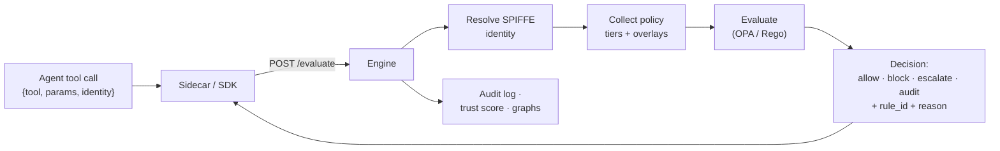
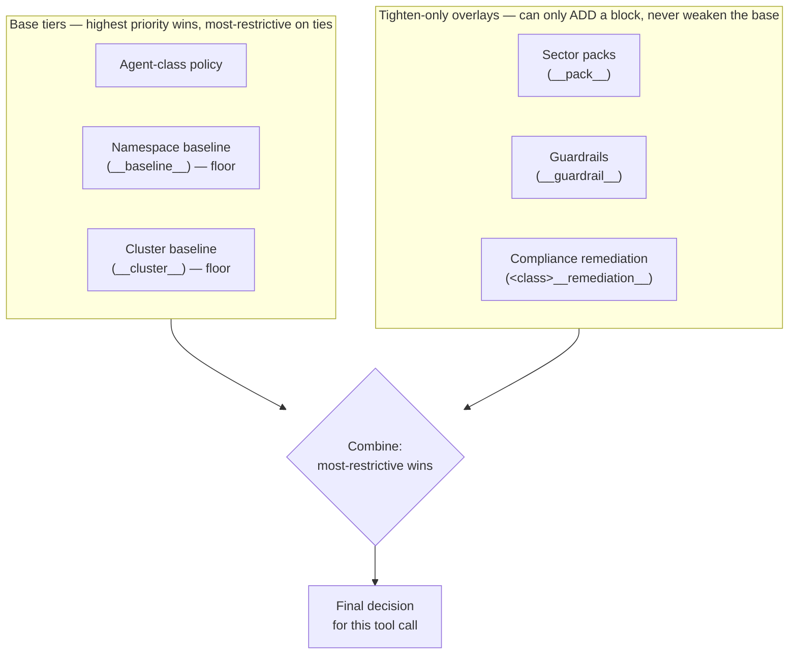

<!-- SPDX-License-Identifier: Apache-2.0 -->
<!-- Copyright 2026 Norviq Contributors -->

# Concepts

The mental model behind Norviq: how an agent is identified, how policies are layered, how a
decision gets made, and what happens after it does.



## Agent identity

Every tool call carries an `AgentIdentity` — a SPIFFE SVID, not a shared API key. The SPIFFE ID has
the shape:

```
spiffe://norviq/ns/<namespace>/sa/<agent_class>
```

`namespace` is the Kubernetes namespace the agent's pod runs in; `agent_class` is derived from the
service account / `norviq.io/agent-class` pod label. Because identity comes from the platform (SPIRE
issuing an SVID to the workload), an agent cannot assert its own trustworthiness or spoof another
class's identity by changing a request body — the identity is bound to *where the pod runs*, not to
what it claims.

Norviq supports two identity-resolution modes (`NRVQ_SPIFFE_MODE`):

- **`mock`** (default) — identity comes from environment variables set on the pod. Used for local
  development, tests, and the attack suite where a real SPIRE deployment isn't available.
- **`workload-api`** — the sidecar fetches a real X.509 SVID from the SPIFFE Workload API socket. This
  mode is **fail-closed**: a socket or SVID error blocks the call rather than silently falling back to
  an env-var identity.

Example: a pod in namespace `chatbot-prod` running as agent class `customer-support` presents
`spiffe://norviq/ns/chatbot-prod/sa/customer-support`. Every policy lookup and every trust-score
bucket is keyed off that pair.

## Agent classes (`NrvqClass`)

An `NrvqClass` is a cluster-scoped CRD that describes *what kind of agent this is* — a labeled role
like `customer-support` or `data-analyst`. It's not itself a Rego policy; it's metadata that seeds
sane defaults and documents intent:

```yaml
apiVersion: norviq.io/v1alpha1
kind: NrvqClass
metadata:
  name: customer-support
spec:
  description: Customer-facing chatbot agents for orders, refunds, and product help
  allowedTools: [search_kb, get_customer, get_order, update_order_status, send_email]
  blockedTools: [execute_sql, delete_record, spawn_pod, exec_shell]
  maxCallsPerMinute: 60
  initialTrustScore: 0.8
  trustThreshold: 0.4
```

`allowedTools`/`blockedTools` document the class's intended tool surface (and feed the policy/intent
generators); `initialTrustScore` and `trustThreshold` seed that class's starting point in the trust
model. The actual enforcement — what happens when `execute_sql` is called — is defined by an
`NrvqPolicy` targeting this class.

## Policies (`NrvqPolicy`)

An `NrvqPolicy` targets an agent class, a namespace, or a specific workload, and supplies the Rego
that decides `allow`/`block`/`escalate`/`audit` for that target. You author a policy in one of two
ways: pick a `preset` (`strict` / `moderate` / `permissive`, shipped in `webhook/presets/`), or supply
custom `rego` directly.

The engine queries `data.<package>.decision` — every policy module (preset or custom) must define, at
minimum:

```rego
package norviq.custom.sql_guard

violation {
  input.tool_name == "execute_sql"
  contains(lower(input.tool_params.query), "drop")
}

decision = "block" { violation }
decision = "allow" { not violation }
rule_id = "custom_sql_guard" { decision == "block" }
reason = "DROP statement blocked by custom policy" { decision == "block" }
rule_id = "default_allow" { decision == "allow" }
reason = "Allowed" { decision == "allow" }
```

A well-formed policy also declares `default decision = "allow"` (with matching `default rule_id`/
`reason`) so an unmatched call resolves to an explicit, named allow rather than a bare undefined
value. This matters because the engine treats one specific undefined case as fail-closed rather than
allow: if a policy's *partial-set* rules (`blocks`/`escalates`/`audits`, the pattern
`comprehensive.rego` uses — see below) fire but no top-level `decision` is produced, that's a
detection that matched with no resolver to turn it into a decision, and the engine fails closed
(`evaluator_invalid_payload`) rather than risk silently allowing a fired block. The shipped
`comprehensive.rego` package follows this same
`decision`/`rule_id`/`reason` contract; it just derives those three values from a larger set of
partial-set detection rules (injection, PII/PCI, destructive verbs, etc.) via a deterministic
resolver, so several rules can fire on one call without producing a compile-time conflict.

An `NrvqPolicy`'s `target` is one of: `agentClass` (applies to every agent of that class, any
namespace), `namespace` (applies to every agent in that namespace — a namespace baseline), or `kind`
+ `name` (applies to one specific workload, e.g. a `Deployment`). `priority` (0–499 for namespace
users, 500–1000 admin-only via `clusterPriority`) breaks ties when more than one policy targets the
same call.

## Policy tiers & precedence

For a given tool call, the engine doesn't evaluate just one policy — it collects every candidate
policy that could apply and resolves them together:

1. **Agent-class policy** — `(namespace, agent_class)`, the most specific tier.
2. **Namespace baseline** — `(namespace, __baseline__)`, a floor for every agent in that namespace
   regardless of class.
3. **Cluster baseline** — `(__cluster__, __baseline__)`, a floor for the whole cluster.

These three are resolved by **highest priority wins**, with the most restrictive decision
(`block < escalate < audit < allow`) breaking ties. A namespace or cluster baseline is a *floor*, not
a default: if it has a higher priority than the class policy, its stricter decision wins even though
the class policy is more specific.

On top of that base layer, Norviq supports **tighten-only overlays** that can only make a decision
*more* restrictive than the base result, never less — regardless of their own priority:

- **`__pack__`** — an opt-in sector compliance pack (e.g. finance/healthcare/telecom controls).
- **`__guardrail__`** — an opt-in per-namespace tool allowlist.
- **`<class>__remediation__`** — a per-class overlay generated by the compliance "generate enforcing
  policy" workflow; it *adds* a block for one specific gap, it never replaces the class's base policy.

These overlays are resolved separately from the base tiers and then combined by most-restrictive-wins:
an overlay's `block` beats a permissive base `allow`, but an overlay can never turn a base `block`
into an `allow`. (Two narrower escape hatches exist for operators: `__pack_override__` lets an
operator *tighten* a sector pack further, and `__pack_weaken__` lets an admin explicitly relax a
pack's own added restriction — but a weaken can never reach outside the pack family to relax a
`__guardrail__` or a `__remediation__` overlay, which stay hard tighten-only.)



**Example:** namespace `chatbot-prod` has a class policy (`customer-support`, `strict` preset,
priority 200) and a namespace baseline (`chatbot-prod`, `permissive` preset, `audit` mode, priority
50). The class policy wins on priority. If a finance sector pack is also enabled for that namespace
and it blocks `execute_sql` while the class policy would allow it, the pack's `block` wins because
overlays only ever tighten.

## Enforcement modes

A matching policy resolves to one of three enforcement outcomes — the `decision` its Rego emits for
that call:

- **`block`** — a violating call is denied outright; the agent receives a deny + `reason`.
- **`escalate`** — the call is flagged for human/out-of-band review rather than auto-denied or
  auto-allowed (also triggered automatically for a low-trust agent's would-be `allow`, see below).
- **`audit`** — the call is logged with what *would* have happened, but is allowed to proceed.

**Where the mode comes from.** For a **generated** policy (an intent allowlist, a preset, a
compliance-remediation draft), the `enforcementMode` you choose is what the generated Rego emits — pick
`audit` and it produces `audit` decisions, so you can watch before you block. For a **hand-written**
Rego policy, the `decision` in your Rego is authoritative; the stored mode is metadata for the console,
not a separate switch the engine applies at evaluation time.

**Namespace monitor mode.** To roll out enforcement observably across a *whole namespace* without
editing individual policies, put the namespace into monitor mode
(`PUT /api/v1/settings {"enforcement_mode":"audit"}`). The engine then softens every would-be
`block`/`escalate` to a logged `audit` (`rule_id` prefixed `monitor_would_block:`) for that namespace —
except a small set of decisions that stay hard regardless of posture (an admin trust freeze, an
engine-not-ready block, and the rate limiter), because those are safety/health signals, not policy
calls to be monitored away. See also the `/policies/dry-run` replay for testing a policy against real
recent traffic before applying it.

## Decisions

Every evaluated tool call resolves to a `PolicyDecision` with three required fields: **`decision`**
(`allow`/`block`/`escalate`/`audit`), **`rule_id`** (which rule produced it — never blank on a block),
and **`reason`** (a human-readable explanation). This triple is what gets returned to the caller,
logged to the audit trail, and shown in the console.

Norviq is **fail-closed**: if OPA evaluation fails, times out, the agent's SPIFFE identity is
malformed, or no policy at all is loaded for a namespace that's in `block` mode, the call is denied —
never silently allowed. Each fail-closed path carries its own named `rule_id` (e.g.
`evaluator_error`, `evaluator_timeout`, `invalid_spiffe_identity`, `no_policy_loaded`) so an
engine-health problem is never mistaken for a real policy block in the audit log.

## Trust score

Alongside the policy decision, every call updates a per-agent **trust score** — a weighted sum of
seven behavioral signals (violation rate, tool novelty, scope drift, parameter entropy, time decay,
call-chain depth, session velocity) computed fresh on every call from the agent's recent history, not
asserted by the caller. The score buckets into `high`/`medium`/`low`/`frozen`; a `low`-trust agent has
its would-be `allow` decisions escalated for review, and a `frozen` agent (an admin kill switch) has
every call blocked, regardless of what the underlying policy says.

## Asset graph & attack graph

As tool calls are evaluated, Norviq incrementally builds an **asset graph** per namespace — a graph of
agents, the tools they've called, and the data/resources those tools touch — so you can see an agent's
real reach, not just its declared one. The **attack graph** walks that asset graph from each agent
node looking for paths to sensitive data or dangerous tools (destructive verbs like `delete_record`,
`drop_table`, `execute_sql`, `transfer_funds`), scoring and mapping them to MITRE ATLAS techniques
where applicable. Together they turn "what could this agent theoretically reach" into a live,
evidence-based picture grounded in what it has actually been observed calling.
