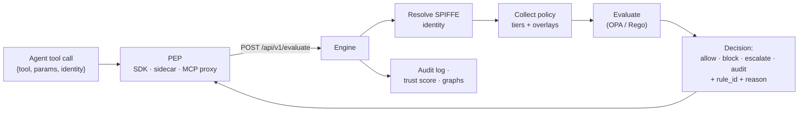
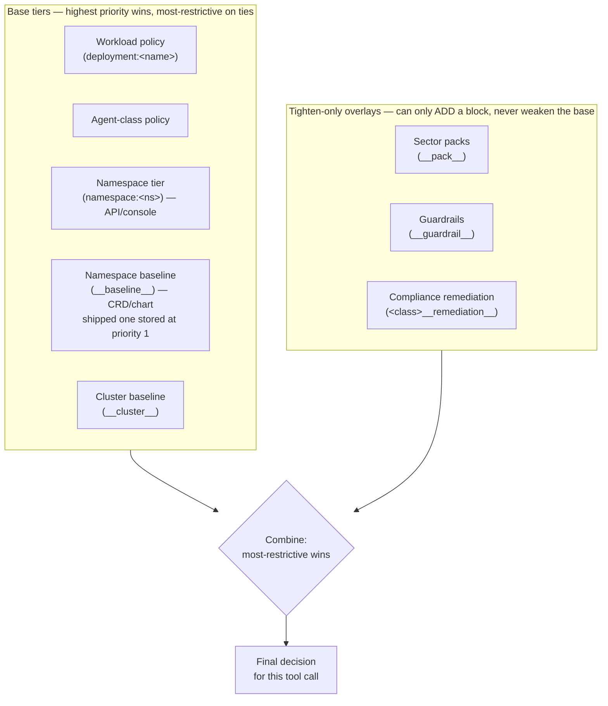

<!-- SPDX-License-Identifier: Apache-2.0 -->
<!-- Copyright 2026 Norviq Contributors -->

# Concepts

The mental model behind Norviq: how an agent is identified, what counts as a governed tool call
(including one that arrives over MCP), how policies are layered, how a decision gets made, and what
happens after it does.


```mermaid
flowchart LR
    A["Agent tool call<br/>{tool, params, identity}"] --> P["PEP<br/>SDK · sidecar · MCP proxy"]
    P -->|POST /api/v1/evaluate| E["Engine"]
    E --> I["Resolve SPIFFE<br/>identity"]
    I --> C["Collect policy<br/>tiers + overlays"]
    C --> O["Evaluate<br/>(OPA / Rego)"]
    O --> R["Decision:<br/>allow · block · escalate · audit<br/>+ rule_id + reason"]
    R --> P
    E --> L["Audit log ·<br/>trust score · graphs"]
```

## Agent identity

Every tool call carries an `AgentIdentity`, not a shared API key. Two of its fields do the work, and
they have *different provenance* — a distinction that matters more than it looks:

- **`spiffe_id`**, of the shape `spiffe://norviq/ns/<namespace>/sa/<service_account>`
  (`_parse_norviq_spiffe_id`, `norviq/engine/identity.py:40-50`). The last segment is the **service
  account**, not the agent class. `spiffe_id` keys the trust record, the per-agent rate limit, and the
  admin freeze.
- **`agent_class`**, a separate field, taken from the `norviq.io/agent-class` pod label that the
  injector copies into `NRVQ_AGENT_CLASS` on the sidecar (`webhook/injector.go:305`). It selects which
  Rego program is enforced: policy lookup is keyed `(namespace, agent_class)` (`_collect_candidates`,
  `norviq/engine/evaluator.py:1941`), never parsed back out of the SVID path.

An agent cannot spoof another class by editing a request body — but read the reason carefully, because
under the shipped default it is not platform attestation. The injector mints the sidecar's own token
carrying `namespace`, `agent_class` and (in `mock` mode) `spiffe_id` as claims, and `scoped_identity`
(`norviq/api/auth.py:390`) then *overwrites* those fields in the request body with the credential's
values. An explicit mismatch is a loud 403; an omitted field is corrected silently, because a dropped
`agent_class` would otherwise fall through to the looser `__baseline__`. That binding, not SPIRE, is
what holds by default.

Norviq supports two identity-resolution modes (`NRVQ_SPIFFE_MODE`, default `mock` —
`norviq/config.py:74`):

- **`mock`** (default, and therefore what an ordinary install runs) — identity comes from environment
  variables set on the pod. Nothing is cryptographically attested; the credential binding above is the
  control. Also used for local development, tests, and the attack suite.
- **`workload-api`** — the sidecar fetches a real X.509 SVID from the SPIFFE Workload API socket, and
  the namespace and service account come from that SVID *only* — env is never read
  (`norviq/engine/identity.py:165`). This mode is **fail-closed**: a socket or SVID error raises
  `SpiffeResolutionError` rather than silently falling back to an env-var identity.

**One consequence of the default is worth stating plainly.** The injector sets `NRVQ_AGENT_CLASS` and
`NRVQ_NAMESPACE` but never `NRVQ_SERVICE_ACCOUNT`, so `_mock_resolve`
(`norviq/engine/identity.py:175-188`) builds `spiffe://norviq/ns/<namespace>/sa/default`; the webhook
hard-codes that same string into the token's `spiffe_id` claim (`webhook/injector.go:396`) and
`TestSidecarTokenSpiffeClaimMatchesMockResolver` locks the two formulas together. So a pod in namespace
`chatbot-prod` running as agent class `customer-support` presents
`spiffe://norviq/ns/chatbot-prod/sa/default` — not `.../sa/customer-support`. Policy still resolves per
class, because policy is keyed on `agent_class`. **Trust does not**: the trust record is keyed
`trust:{spiffe_id}` (`norviq/engine/cache.py:271`), so under the shipped default every injected pod in
a namespace shares *one* trust bucket regardless of class. Set `NRVQ_SERVICE_ACCOUNT` per workload, or
run `workload-api`, if you need per-class trust separation.

## Agent classes (`NrvqClass`)

An `NrvqClass` is a cluster-scoped CRD that describes *what kind of agent this is* — a labeled role
like `customer-support` or `data-analyst`. It's not itself a Rego policy, and — see the caveat below —
it is not configuration either. Today it documents intent:

```yaml
apiVersion: norviq.io/v1alpha1
kind: NrvqClass
metadata:
  name: customer-support
spec:
  description: Customer-facing chatbot agents for orders, refunds, and product help
  allowedTools: [search_kb, get_customer, get_order, update_order_status, send_email]
  blockedTools: [execute_sql, delete_record, spawn_pod, exec_shell]
  maxCallsPerMinute: 60
  initialTrustScore: 0.8
  trustThreshold: 0.4
```

**`spec` is schema-valid and inert — none of these fields reach the engine.** The CRD controller
watches `NrvqClass`, but `processClass` (`webhook/controller.go:653`) only writes `.status` back
(`agentCount`, `averageTrustScore`, `policyCount`); it reads no `spec` field. `initialTrustScore` has
no consumer anywhere in the shipped code, and `allowedTools`/`blockedTools` feed no policy or intent
generator — the `allowed_tools` the `scope_drift` trust signal reads
(`norviq/engine/trust/signals/scope_drift.py:20`) is the *learned* behavioral profile, unrelated to
this field. `trustThreshold` has a live equivalent, but it is the per-namespace setting
(`PUT /api/v1/settings {"trust_threshold": …}` → `_tiers`), not this one. Treat the YAML above as the
intended shape of the interface; see [`security-model.md`](security-model.md) and
[`trust-score-design.md`](trust-score-design.md) for the same gap stated from the other two sides.

The actual enforcement — what happens when `execute_sql` is called — is defined by an `NrvqPolicy`
targeting this class, and the class's real runtime role is to be the label that both routes the pod to
the injector and selects that policy.

**How a pod becomes an agent of a class.** Under the shipped default the class label is also the
*admission* trigger, and the contract is opt-in on both sides: a pod is routed to the injector only
when its namespace carries `norviq-injection=enabled` **and** the pod itself carries a
`norviq.io/agent-class` label (`webhook.injection.gateOnlyAgentPods: true`,
`helm/norviq/values.yaml:429`). The two are a `namespaceSelector` and an `objectSelector` on the same
webhook (`helm/norviq/templates/webhook-config.yaml:50-81`); the object side matches on `Exists`, so
routing turns on the label's *presence* while its *value* is what later selects the class's policy. The
per-pod gate exists so that a Norviq outage cannot block creation of the namespace's database, ingress
controller, or batch jobs — workloads Norviq does not govern — while a real agent pod still cannot
start un-injected under `failurePolicy: Fail`.

The cost of that trade is worth stating plainly: **an unlabelled pod is never routed and runs
entirely ungoverned**, and it starts cleanly, so nothing in the pod or the console announces it.
Nothing today computes injected-vs-expected, so there is no warning to wait for; verify by hand with
`kubectl get pods -n <ns> -L norviq.io/agent-class` and read every blank as ungoverned. Injection is
CREATE-only, so a label added to a running pod takes effect on that pod's next restart, and an
upgrade that turns this default on silently un-governs any pod that was relying on namespace-wide
injection.

## Policies (`NrvqPolicy`)

An `NrvqPolicy` targets an agent class, a namespace, or a specific workload, and supplies the Rego
that decides `allow`/`block`/`escalate`/`audit` for that target. There are three authoring paths: pick
a `preset` (`strict` / `moderate` / `permissive`, shipped in `webhook/presets/`), supply custom `rego`
directly, or compose the policy in the **visual builder** (below). All three end in the same place — a
Rego module the loader pushes to OPA — and every one of them must satisfy the contract that follows.

The engine queries the package *root* — `data.<package>` (`_opa_query_for_package`,
`norviq/engine/evaluator.py:1636-1639`) — and reads `decision`, `rule_id` and `reason` out of the
document that comes back. (It queries the root rather than `data.<package>.decision` precisely so it
can also see the partial sets discussed below.) Every policy module, preset or custom, must therefore
define at minimum:

```rego
package norviq.custom.sql_guard

violation {
  input.tool_name == "execute_sql"
  contains(lower(input.tool_params.query), "drop")
}

decision = "block" { violation }
decision = "allow" { not violation }
rule_id = "custom_sql_guard" { decision == "block" }
reason = "DROP statement blocked by custom policy" { decision == "block" }
rule_id = "default_allow" { decision == "allow" }
reason = "Allowed" { decision == "allow" }
```

A well-formed policy also declares `default decision = "allow"` (with matching `default rule_id`/
`reason`) so an unmatched call resolves to an explicit, named allow rather than a bare undefined
value. This matters because the engine treats one specific undefined case as fail-closed rather than
allow: if a policy's *partial-set* rules (`blocks`/`escalates`/`audits`, the pattern
`comprehensive.rego` uses — see below) fire but no top-level `decision` is produced, that's a
detection that matched with no resolver to turn it into a decision, and the engine fails closed
(`evaluator_invalid_payload`) rather than risk silently allowing a fired block. The shipped
`comprehensive.rego` package follows this same
`decision`/`rule_id`/`reason` contract; it just derives those three values from a larger set of
partial-set detection rules (injection, PII/PCI, destructive verbs, etc.) via a deterministic
resolver, so several rules can fire on one call without producing a compile-time conflict.

An `NrvqPolicy`'s `target` is one of: `agentClass`, `namespace`, or `kind` + `name` (one specific
workload, e.g. a `Deployment`). `priority` (0–499 for namespace users, 500–1000 admin-only via
`clusterPriority`) breaks ties when more than one policy targets the same call.

`NrvqPolicy` is a **namespaced** CRD, and the controller stores a policy under the namespace the CR
object itself lives in (`payload.Namespace = u.GetNamespace()`, `webhook/controller.go:923-924`) — so
an `agentClass` target governs agents of that class **in that namespace**, not cluster-wide. The one
exception is the whole-namespace cluster baseline: a policy that sets `clusterPriority` and targets a
`namespace` with no class or workload is re-keyed to `(<targetNs>, __baseline__)`
(`namespaceBaselineKey`, `webhook/controller.go:1008-1028`), which is how a policy authored in the
control-plane namespace reaches a tenant namespace at all.

### Two authoring surfaces, one Rego contract

The Policy Catalog offers **Visual Builder** and **Advanced (raw rego)**
(`ui/src/pages/PolicyCatalog.tsx:1876-1887`). The builder is a guided form, not a second policy model:
an operator composes a *graph* — a scope, a mode, and a list of conditions or allowed tools — and
`compileGraph()` (`ui/src/lib/builderCompile.ts:2372`) turns that graph, deterministically and in the
browser, into a module of exactly the shape described above. There is no second evaluator, no second
resolver, and no MCP- or builder-specific decision path.

The mode decides which package it emits (`packagePrefixFor`, `ui/src/lib/builderCompile.ts:2290`;
`BuilderMode = "rules" | "allowlist"`, `ui/src/lib/builderGraph.ts:252`). The labels below are the
ones the sheet actually renders (`MODE_LABEL`, `ui/src/components/policies/BuilderSheet.tsx:593-596`):

| Builder mode | Emits | Means |
|---|---|---|
| Tighten-only rules | `package norviq.custom.<token>` | adds blocks on top of what is already allowed; a call no rule matches keeps its current outcome and falls through to a scoped `builder_default_<scope-token>` allow |
| Allowlist (deny by default) | `package norviq.intent.<token>` | default-deny for the scope: only the listed tools, and only while the enabled refinements and every per-tool argument constraint hold |

`norviq.custom.` is the same package namespace a hand-written policy uses, and that is the point — to
the loader, to OPA, and to `GET /api/v1/policies/effective`, a builder-authored tighten-only policy is
indistinguishable from one typed into the editor. `norviq.intent.` is separate only so the server's
own intent classification can recognize an allowlist.

What the builder buys is that the dangerous shapes are *unrepresentable* rather than discouraged: it
always emits the canonical `blocks`/`escalates`/`audits` resolver plus a scoped `default decision`, so
a decision-less module cannot be produced; every operator-supplied string is `JSON.stringify`'d into a
Rego string literal, so graph content cannot inject Rego syntax; and a reserved scope is refused with a
compile error and an empty `rego` string (`compileGraph` returns `{rego: "", errors}` — callers must
not save an empty result). "Reserved" is one shared predicate, `isReservedScope`
(`ui/src/lib/reservedScope.ts:13-16`): **any agent class beginning with `__`** (so `__baseline__`,
`__guardrail__`, `__pack__` and the pack override/weaken keys all fall in), plus `__cluster__` used as
a target namespace. Note the deliberate exception: a per-class compliance overlay key is
`<real-class>__remediation__`, which does *not* start with `__`, and stays authorable through the
generic policy UI.

**The graph rides inside the Rego, and the trip is one-way.** A compiled module carries its own graph
base64-encoded in a `# nrvq-builder-graph/v1:` header comment, plus an FNV-1a hash of the body in
`# nrvq-builder-hash:`. Reopening the policy rehydrates the exact graph; hand-editing the Rego
afterwards breaks the hash and `detachmentStatusOf()` (`ui/src/lib/builderCompile.ts:2347`) reports
**detached**, which the Catalog surfaces as a badge — reopening such a policy in the builder would no
longer reconstruct what is actually live. There is deliberately no round-trip from arbitrary Rego back
into a graph. Note the consequence: the graph is a comment in the policy source rather than a column
in the `policies` table, so nothing server-side indexes, migrates, or independently verifies it.

## Policy tiers & precedence

For a given tool call, the engine doesn't evaluate just one policy — it collects every candidate
policy that could apply and resolves them together:

1. **Workload policy** — `(namespace, deployment:<workload>)`, collected only when the caller actually
   reports its workload (Norviq never guesses one from a pod name).
2. **Agent-class policy** — `(namespace, agent_class)`.
3. **Namespace tier** — `(namespace, namespace:<namespace>)`, applying to every call in the namespace.
   This is where a namespace-scoped policy written through the API or the console lands
   (`resolve_policy_key`, `norviq/api/routers/policies.py:727`).
4. **Namespace baseline** — `(namespace, __baseline__)`, catching every agent in that namespace
   regardless of class, and a *different* slot from tier 3. An `NrvqPolicy` reaches this slot only when
   it sets `clusterPriority` and targets a `namespace` with no class or workload
   (`namespaceBaselineKey`, `webhook/controller.go:1008-1028`); the Helm chart's per-namespace
   `baseline-cluster-guard-<ns>` is exactly that shape
   (`helm/norviq/templates/baseline-cluster-policy.yaml`, rendered once per entry in
   `policyQuotaNamespaces`). Two namespace-wide policies applied through the two different surfaces
   therefore *coexist* as separate candidates, while a second cluster-priority `NrvqPolicy` on the same
   target namespace replaces the chart's guard rather than layering under it.
5. **Cluster baseline** — `(__cluster__, __baseline__)`, a floor for the whole cluster.

These are resolved by **highest priority wins**, with the most restrictive decision
(`block < escalate < audit < allow`) breaking ties. Priority, not specificity, decides: a baseline with
a higher priority than the class policy wins even though the class policy is more specific.

One caveat about the baseline that actually ships, because the numbers do not read the way they look.
The chart sets `baselineClusterPolicy.clusterPriority: 900` (`helm/norviq/values.yaml:70`), but the CRD
controller deliberately *discards* that as the evaluation priority and stores the baseline at
`baselineFallbackPriority = 1` (`webhook/controller.go:975-982`, `:1001`). `clusterPriority` there authorizes
the cross-namespace target; it is not the weight. So the shipped baseline behaves as a **fallback that
only decides when nothing more specific matched**, not as a floor that can outrank a namespace or class
policy — the reasoning being that the `strict` preset allows anything it does not recognise as
destructive, so a high-priority baseline would have *weakened* stricter policies sitting under it. A
baseline you author yourself with an ordinary `priority` is a genuine floor.

On top of that base layer, Norviq supports **tighten-only overlays** that can only make a decision
*more* restrictive than the base result, never less — regardless of their own priority:

- **`__pack__`** — an opt-in sector compliance pack (e.g. finance/healthcare/telecom controls).
- **`__guardrail__`** — an opt-in per-namespace overlay, typically a tool allowlist. The shipped MCP
  integration guardrail (`policies/templates/mcp_integration_guardrail.rego`) is materialized here.
- **`<class>__remediation__`** — a per-class overlay generated by the compliance "generate enforcing
  policy" workflow; it *adds* a block for one specific gap, it never replaces the class's base policy.

These overlays are resolved separately from the base tiers and then combined by most-restrictive-wins:
an overlay's `block` beats a permissive base `allow`, but an overlay can never turn a base `block`
into an `allow`. (Two narrower escape hatches exist for operators: `__pack_override__` lets an
operator *tighten* a sector pack further, and `__pack_weaken__` lets an admin explicitly relax a
pack's own added restriction — but a weaken can never reach outside the pack family to relax a
`__guardrail__` or a `__remediation__` overlay, which stay hard tighten-only.)


```mermaid
flowchart TB
    subgraph base["Base tiers — highest priority wins, most-restrictive on ties"]
        wl["Workload policy<br/>(deployment:&lt;name&gt;)"]
        cls["Agent-class policy"]
        nst["Namespace tier<br/>(namespace:&lt;ns&gt;) — API/console"]
        nsb["Namespace baseline<br/>(__baseline__) — CRD/chart<br/>shipped one stored at priority 1"]
        clb["Cluster baseline<br/>(__cluster__)"]
    end
    subgraph ov["Tighten-only overlays — can only ADD a block, never weaken the base"]
        pack["Sector packs<br/>(__pack__)"]
        guard["Guardrails<br/>(__guardrail__)"]
        rem["Compliance remediation<br/>(&lt;class&gt;__remediation__)"]
    end
    base --> M{"Combine:<br/>most-restrictive wins"}
    ov --> M
    M --> D["Final decision<br/>for this tool call"]
```

**Example:** namespace `chatbot-prod` has a class policy (`customer-support`, `strict` preset,
priority 200) and a namespace baseline (`chatbot-prod`, `permissive` preset, `audit` mode, priority
50). The class policy wins on priority. If a finance sector pack is also enabled for that namespace
and it blocks `execute_sql` while the class policy would allow it, the pack's `block` wins because
overlays only ever tighten.

## Enforcement modes

A matching policy emits a `decision` for the call. Besides a plain `allow`, there are three
enforcement outcomes:

- **`block`** — a violating call is denied outright; the agent receives a deny + `reason`.
- **`escalate`** — the call does **not** proceed, and is recorded as `escalate` so it can be picked up
  out of band. Be precise about what ships. Both PEPs refuse it: the SDK raises `NorviqEscalateError`
  (`norviq/sdk/core/interceptor.py:113-115`), distinct from the `NorviqBlockError` a `block` raises, and
  the MCP proxy answers the call locally without forwarding it, since `is_allowed()` covers only
  `allow` and `audit` (`norviq/sdk/core/decisions.py:35-37`, `norviq/mcp/firewall.py:815`). The decision
  lands in the audit log and the console's decision counts, and that is where it ends: there is **no**
  shipped review queue and no approve-and-replay path. "Escalate" today means "refused, and attributed
  differently from a policy block", not "held pending a human". (Also triggered automatically for a
  low-trust agent's would-be `allow`, see below.)
- **`audit`** — the call is logged with what *would* have happened, but proceeds; `is_allowed()` treats
  it as an allow at both PEPs.

**Where the mode comes from — one layer, not two.** It is tempting to assume `enforcementMode` also
steers *generation*, and it does not: no shipped generator accepts a mode. `generate_intent_rego`
(`norviq/api/threat_intent.py:242`) always emits a default-deny allowlist with `block` decisions;
`generate_remediation_rego` / `generate_remediation_overlay_rego` (`:660`, `:726`) always emit
default-allow modules with `block` clauses; and the presets are static files (`webhook/presets/`
`strict.rego` · `moderate.rego` · `permissive.rego`) whose decisions are fixed on disk. Choosing
`enforcementMode: audit` never rewrites any of that Rego.

What *can* emit an `audit` decision directly is an individual rule you author: the visual builder gives
every rule its own `BuilderDecision` of `block` / `escalate` / `audit`
(`ui/src/lib/builderGraph.ts:184`), which compiles into the `audits` partial set and out through the
same resolver. That is a per-rule choice, not a policy-level mode.

The policy-level mode is applied by the engine at evaluation time.
`_apply_policy_mode` (`norviq/engine/evaluator.py:721`) softens the winning policy's `block`/`escalate`
to `audit` when *that policy* is saved with `enforcementMode: audit`, re-attributing it as
`policy_audit_would_block:<original_rule_id>`. So a hand-written module that says `decision = "block"`
still returns `audit` if the policy holding it is in audit mode — your Rego decides *what fires*, the
saved mode decides *how hard it lands*. This layer exists because the Catalog used to render an AUDIT
badge on a policy that hard-blocked anyway: an operator who believed they were trialling a rule safely
was not.

Two limits on it are load-bearing. Only **base and floor** candidates carry a mode — overlays are
excluded by construction, because honouring a tighten-only overlay's mode would let it weaken the base
policy it sits on. And the softening is applied before the eval-cache write, which is safe only
because a policy write invalidates exactly the decisions it affects; namespace posture (below) has no
such write hook, which is why that one has to stay a per-call override instead.

**Namespace monitor mode.** To roll out enforcement observably across a *whole namespace* without
editing individual policies, put the namespace into monitor mode
(`PUT /api/v1/settings {"enforcement_mode":"audit"}`). The engine then softens every would-be
`block`/`escalate` to a logged `audit` (`rule_id` prefixed `monitor_would_block:`) for that namespace.
Monitor mode only ever *softens*; it never turns an `allow` into a block.

A fixed set of `rule_id`s stays hard regardless of posture — `trust_frozen` (the admin kill switch),
`policy_load_pending` and `evaluator_error` / `evaluator_invalid_payload` (engine health), and
`rate_limit_exceeded` (`_POSTURE_EXEMPT_RULES`, `norviq/engine/evaluator.py:329`) — because those are
safety/health signals, not policy calls to be monitored away. The same exemption list applies to the
per-policy audit mode above, so neither layer can monitor away a trust freeze or an engine-health
block. See also the `POST /api/v1/policies/dry-run` replay for testing a policy against real recent
traffic before applying it.

## Decisions

Every evaluated tool call resolves to a `PolicyDecision` with three required fields: **`decision`**
(`allow`/`block`/`escalate`/`audit`), **`rule_id`** (which rule produced it — never blank on a block),
and **`reason`** (a human-readable explanation). This triple is what gets returned to the caller,
logged to the audit trail, and shown in the console.

Norviq is **fail-closed**: if OPA evaluation fails, times out, the agent's SPIFFE identity is
malformed, or no policy at all is loaded for a namespace that's in `block` mode, the call is denied —
never silently allowed. Each fail-closed path carries its own named `rule_id` (e.g.
`evaluator_error`, `evaluator_timeout`, `invalid_spiffe_identity`, `no_policy_loaded`) so an
engine-health problem is never mistaken for a real policy block in the audit log.

## MCP servers & tools

An agent's *class* says what kind of caller it is. The **MCP servers** it connects to supply the tools
it can actually name — so a server, and each tool definition it publishes, is a governed object in its
own right. Not because MCP needs a second policy engine, but because a server is a third party whose
text reaches the model.

Norviq governs it with an inline proxy (`norviq/mcp/`). The injector rewrites an annotated container's
command so the proxy execs the real MCP server behind it, and an init container supplies the proxy
binary, so the server's own image needs nothing installed — the same zero-code-change deal the sidecar
gives the SDK. The proxy is a protocol adapter, not an engine: a `tools/call` maps 1:1 onto the same
`ToolCallEvent` the SDK emits (`tool_name` = the tool's name, `tool_params` = its `arguments`) and
goes to the same `POST /api/v1/evaluate`. **Every policy you already have governs MCP traffic
unchanged** — no MCP-specific rule is needed to police a dangerous tool call.

What the proxy adds is a second gate, at a deliberately different cost
(`norviq/mcp/__init__.py:18-28`, `norviq/mcp/firewall.py:11-19`):

| Gate | Runs on | How often | What it does |
|---|---|---|---|
| **B — invocation** | `tools/call`, `resources/read`, `sampling/createMessage` | every call | one `/evaluate` round trip; a `block` is answered locally, so the upstream server never executes it |
| **A — discovery** | `initialize`, `tools/list`, `prompts/get`, `notifications/*_changed` | a handful of times per session | scans tool *definitions* for instructions hidden in the text the model is about to read (tool poisoning), and content-hash **pins** each definition so a later change is detected (rug pull) |

`resources/read` and server-initiated `sampling/createMessage` are in Gate B's scope because their
results land in the model's context exactly like a tool result (`mcp_govern_resources` /
`mcp_govern_sampling`, both default `true` — `norviq/config.py:217,209`). Gate A never runs on the
call path: the per-call Gate-A cost is one dict lookup against a catalog built at discovery, which is
the entire reason the two are separated rather than re-derived per call.

**Gate A is a heuristic and evadable by construction; Gate B is the deterministic backstop.** Read a
clean Gate A as "nothing matched the patterns we have", never as "this server is honest".
`DESIGN-NOTE-MCP-FIREWALL.md` is the threat model for what Gate A does not catch.

### Definition pins

A pin is a content hash of one tool's definition plus the operator judgement attached to it. The
stored status is derived, not written (`_status_of`, `norviq/api/routers/mcp.py:112-118`):

| Status | Meaning |
|---|---|
| `pinned` | the served definition matches the approved one |
| `drift` | the server is serving a definition that differs from the approved hash — the rug-pull signal |
| `quarantined` | not approved, either not yet or not any longer |

`drift` outranks the others in the display, because the *fact* of the change is the finding — a
different class of problem from "this description looks suspicious". A tool in `drift` or
`quarantined` is refused on the call path by the proxy itself, before Gate B ever runs
(`norviq/mcp/firewall.py:765-781`). A fourth verdict, `first_seen`, is returned to the proxy at
observe time for a definition never seen before; it is not a stored status — the row it creates lands
as `pinned` or `quarantined` depending on the pin mode.

That mode is the decision about what a first sighting is worth. **`tofu`** (the chart default,
`helm/norviq/values.yaml:352`; `norviq/config.py:191`) pins and allows an unseen definition and
enforces *change* thereafter; **`strict`** quarantines it until an operator approves. `strict` is the
safer posture and needs a staffed approval workflow to be practical, which is why it is not the
default.

**Where the approval lives is a trust boundary, not a storage choice.** The proxy *observes*; the
control plane *approves*. The proxy `POST`s what it saw to `/api/v1/mcp/pins/observe` and the **server**
computes the verdict, so the approved digest never leaves the control plane and a compromised proxy
cannot mark its own drift as approved — the worst it can do is fail to report, which leaves the
previous state standing. Approval and revocation are admin-only (`POST /api/v1/mcp/pins/approve`,
`/revoke`), and an approval names an explicit digest: a server that changes its definition again
between the operator reading it and the approval landing cannot get the new one blessed by a click
meant for the old one. `pinStore: control-plane` is the chart default
(`helm/norviq/values.yaml:349`) for that reason; `memory` and `file` exist for air-gapped
single-process use, and lose their pins with the process or the pod. `GET /api/v1/mcp/servers` rolls
the pins up per server into one triage word — `drift` > `quarantined` > `flagged` > `ok`.

### Reading Gate-A state from policy

The proxy publishes its Gate-A state to Rego as `input.mcp` — `server`, `transport`, `pin_status`,
`scan_severity`, `definition_seen`, the schema-conformance facts, and the plane the decision is on,
which the evaluator lifts to `input.direction` (`_build_input`,
`norviq/engine/evaluator.py:978-984`). Every value was computed at discovery and cached, so reading it
costs a dict lookup. That is what makes "escalate on drift for the payments class but block it
elsewhere" expressible at all, instead of leaving drift to the proxy's one hard-coded action.

Three things to be honest about here:

- **`input.mcp` is PEP-reported, exactly like `input.tool_name`.** It is a *policy* input and never a
  *trust* input. Identity still comes from the caller's attested SVID and is never read out of an MCP
  message, so `input.mcp.server` may decide **what** is being called but never **who** is calling.
- **No shipped baseline reads `input.mcp`** — not `comprehensive.rego`, not any sector pack. The one
  shipped consumer is an opt-in, default-off template
  (`policies/templates/mcp_integration_guardrail.rego`) that an operator materializes as that
  namespace's `__guardrail__` overlay. Out of the box, MCP traffic is governed by your ordinary
  tool-call policy plus the proxy's own Gate-A refusal, and by nothing else. That template is also a
  guardrail rather than a perimeter: it defaults to allow and blocks named conditions, so a tool it
  says nothing about falls through to your baseline.
- **A tool with no catalog entry reports `scan_severity: "unknown"`, not `"none"`.** `none` is what a
  definition that *was* scanned and came back clean carries, so reporting it for a tool Gate A never
  saw would spell "I never looked at this" identically to "I looked and it was fine". `unknown` sits
  outside the severity vocabulary, so it matches no allowlist and no high/critical block — an operator
  who wants to admit unscanned tools has to say so explicitly
  (`norviq/mcp/firewall.py:508-524`).

Also note that `input.direction` currently only ever carries `call` or `answer`: those are the two
values the proxy emits (`norviq/mcp/firewall.py:539`), even though the intent schema's plane
vocabulary also lists `content` (`PLANES`, `norviq/engine/intent/schema.py:59`). An intent rule scoped
to the `content` plane will not fire today.

The whole surface is off by default — `webhook.injection.mcp.enabled: false`
(`helm/norviq/values.yaml:338`) — and every `NRVQ_MCP_*` setting is inert unless the proxy is actually
running, so none of it changes an existing deployment's behaviour. See **[MCP](guides/mcp.md)** for
the deployment contract, the pod annotations that opt a container in, and the full knob reference.

## The tool registry

`GET /api/v1/tools` (`norviq/api/routers/tools.py:160`) answers one question: what tools exist here,
and how well do we know that? It is a read-only projection — it owns no table and writes nothing —
and it returns two tiers side by side that it never merges.

| Tier | Where it comes from | What it proves |
|---|---|---|
| `mcp_declared` | **every** `mcp_tool_pins` row for the namespace — a definition some server published and Gate A recorded | the server published a definition under this name. Each row carries its own `pin_status`, so read that, not the tier |
| `observed` | a distinct `tool_name` in real audit traffic within the window (`range=24h\|7d\|30d\|90d`, default `30d`), with synthetic/red-team/probe rows excluded | the name exists. Nothing whatsoever about its shape |

Two things the declared tier does *not* assert. First, it is not an approval list: the rows are not
filtered on `approved`, so a `quarantined` pin appears here too, and under the default `tofu` pin mode
a first sighting is auto-pinned with no operator in the loop at all — the tier means "Gate A has seen
a definition", and `pin_status` carries the judgement. Second, a declared row does not guarantee a
usable shape: `approved_canonical` is stored as a bare 8 KiB slice, so a verbose description can push
the schema past the cap, leaving invalid JSON that degrades to `schema_available: false`
(`_parse_canonical`, `norviq/api/routers/tools.py:85-101`) — and a description Gate A condemned is
withheld (`description_withheld: true`) rather than echoed into the console.

Keeping them apart *is* the feature, not a column on it. The console's builder used to infer a
"known tools" set by unioning observed names with capability *substrings* — "post", "http", "delete",
which are matching fragments, not identifiers — and then treating that union as an existence oracle;
it offered names that cannot exist and then suppressed its own unknown-tool warning for exactly those
names. The tiers are also keyed on `(namespace, name)` rather than the bare name, because a tool
declared in `payments` and merely observed in `chatbot-prod` is two facts: flattening them would show
an operator authoring policy for `chatbot-prod` an unpinned, unscanned tool of unknown shape as
declared there.

Two properties follow, and both matter when reading the Tools page:

- **An empty list is a normal answer, not "no tools exist".** The declared tier is populated only when
  MCP injection is on, *and* a pod is annotated, *and* its server actually serves a `tools/list` — and
  only the stdio proxy driver flushes its observations to the control plane
  (`norviq/mcp/stdio.py:280,345`; there is no corresponding flush in `norviq/mcp/http.py`), so an
  HTTP-transport proxy contributes no declared rows at all.
- **The registry is an oracle, never a gate.** Nothing in it restricts what an operator may type into
  a policy. Deny-by-default *requires* authoring a rule for a tool nobody has called yet; an allowlist
  you can only write after the fact is not a preventive control. The visual builder warns when a rule
  names a tool outside the registry — it does not refuse it.

The registry reads each pin's `approved_canonical`, never `last_canonical`. The approved copy is the
one currently pinned as approved — under `strict` that is a definition a human blessed, under the
default `tofu` it is the definition first seen and not changed since. Either way, seeding a
policy-authoring picker from whatever a drifted or hostile server is serving *right now* would let
that server steer which arguments an operator believes exist. And where
Gate A stripped or stubbed a description before the model saw it, the registry withholds it too
(`description_withheld: true`) rather than rendering, in the operator's console, the exact injection
text the firewall kept away from the model.

## Trust score

Alongside the policy decision, every call updates a per-agent **trust score** — a weighted sum of
seven behavioral signals (violation rate 0.25, tool novelty 0.20, scope drift 0.15, parameter entropy
0.15, time decay 0.10, call-chain depth 0.10, session velocity 0.05 — `WEIGHTS`,
`norviq/engine/trust/calculator.py:36-44`) computed fresh on every call from the agent's recent
history, not asserted by the caller.

The score buckets into `high` (≥ 0.7), `medium` (≥ 0.4), `low`, and `frozen` (`_categorize`,
`norviq/engine/trust/calculator.py:305-318`); both boundaries move together when a namespace sets its
own `trust_threshold`. A `low`-trust agent has its would-be `allow` decisions turned into `escalate`
(`rule_id: escalate_low_trust`) — which, per [Enforcement modes](#enforcement-modes), means the call is
refused, not queued — and a `frozen` agent has every call blocked (`rule_id: trust_frozen`)
regardless of what the underlying policy says. Freezing is **admin-only** — a computed score never
auto-freezes, however bad it gets — and an admin trust override is tighten-only: it can lower an
agent's effective trust but never raise it (`norviq/engine/trust/calculator.py:124-127`).

## Asset graph & attack graph

As tool calls are evaluated, Norviq incrementally builds an **asset graph** per namespace — agent nodes
and the tool nodes they have actually called — so you can see an agent's real reach, not just its
declared one. The **attack graph** walks that asset graph from each agent node looking for paths to
sensitive data or dangerous tools (`DANGEROUS_TOOLS`, `norviq/engine/attack_graph.py:26-34`:
`delete_record`, `drop_table`, `truncate`, `execute_sql`, `send_email`, `transfer_funds`,
`modify_config`), scoring them and attaching MITRE ATLAS techniques where a mapping exists.

Two honest limits on how "evidence-based" this is. The agent→tool edges are observed traffic, but the
**tool→data edges are not observed at all** — they come from `TOOL_DATA_MAP`
(`norviq/engine/graph/asset_graph.py:35-44`), a static eight-entry table keyed on exact tool names
(`execute_sql` → `postgresql/users|orders|payments`, `get_customer` → `postgresql/customers`, and so
on). A tool outside that table produces no data node and therefore no path to sensitive data, however
much traffic it generates; a tool inside it gets those resource edges whether or not it touched them.
The risk labels are likewise a fixed name→level map (`TOOL_RISK_MAP`, same file), defaulting to
`MEDIUM` for an unrecognised name. And because agent nodes are keyed by `spiffe_id`, the shared
`sa/default` identity described under [Agent identity](#agent-identity) means several classes can land
on one node; the read model expands them into sub-nodes (`norviq/api/routers/graphs.py`) rather than
letting them silently collapse.
