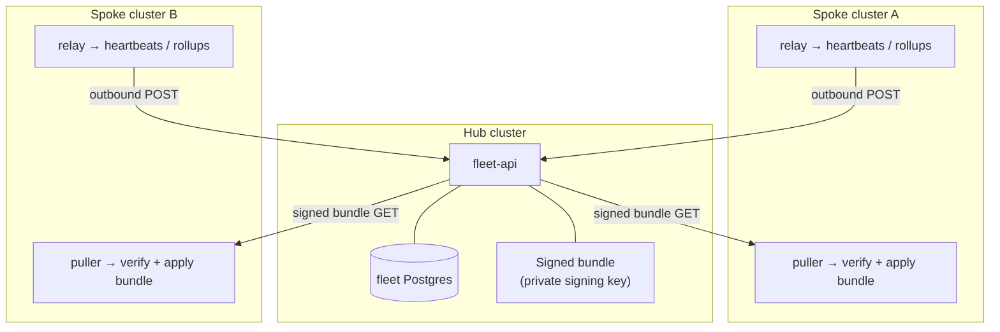

<!-- SPDX-License-Identifier: Apache-2.0 -->
<!-- Copyright 2026 Norviq Contributors -->

# Deployment

Norviq ships as **one Helm chart** (`helm/norviq`) with everything prod-specific — HA, autoscaling,
fleet, SPIFFE workload identity — **values-gated and off by default**. This page walks the topologies
from a single-node eval install through production HA, cloud (AKS), multi-cluster fleet, and real
workload identity, using the overlay files and scripts already in the repo.

## 0. The render guards you hit first

The chart **refuses to render** rather than produce a silently-insecure install. Two of these bite on
a stock `helm install`, so know them before you start:

- **`baselineClusterPolicy.enabled: true` + empty `policyQuotaNamespaces`.** The cluster baseline
  guard renders one `NrvqPolicy` per tenant namespace; with no namespaces listed it would render
  *zero* baselines and leave every agent class unprotected while NOTES.txt claims otherwise. So it
  fails loudly instead. Either list your tenant namespaces in `policyQuotaNamespaces` (top-level, not
  under `config:` — the error text is misleading on this) or set
  `baselineClusterPolicy.enabled=false` to opt out explicitly.
- **`config.requireStrongSecret: true` + empty `postgresql.password` / `redis.password`.** Refuses so
  `NRVQ_PG_URL`/`NRVQ_REDIS_URL` never ship a blank credential. `values.yaml` carries non-empty
  defaults, so you only hit this via an overlay that blanks them — which `values-prod.yaml` does
  deliberately (§2).
- Same flag, with `fleet.hub.enabled`: refuses on an empty or shipped-default (`norviq_dev`) fleet DB
  password, including one embedded in `fleet.hub.pgUrl`.
- **`agentEgressPolicy.enabled: true`** refuses if there are no namespaces to lock down (would protect
  nothing), if `engine` is not `networkpolicy`/`cilium`, or if it targets the Norviq control-plane
  namespace.

Dry-run any values combination locally without touching a cluster:

```bash
helm template norviq ./helm/norviq --set-json 'policyQuotaNamespaces=["my-agents"]'
```

`config.requireStrongSecret` also enforces at **boot**, not only at render: the API refuses to start
on a weak/default/short JWT secret (logs `NRVQ-API-7099`) or the shipped default admin password
(`NRVQ-AUTH-14014`).

## 1. Local (kind) — single node for eval

A single-node [kind](https://kind.sigs.k8s.io/) cluster is enough to evaluate everything except
multi-node HA (§2), a real fleet (§4), and real SPIFFE identity (§5) — those need their own local
stacks, covered below.

```bash
kubectl apply -f helm/norviq/crds/
kubectl create namespace norviq
kubectl create namespace my-agents          # tenant namespace; must exist before install
helm install norviq ./helm/norviq -n norviq \
  --set-json 'policyQuotaNamespaces=["my-agents"]' \
  --set config.dbSslMode=disable            # bundled Postgres has no TLS listener
kubectl -n norviq port-forward svc/norviq-ui 8080:80   # http://localhost:8080
```

Both `--set` flags matter. `policyQuotaNamespaces` satisfies the baseline guard above (§0);
`config.dbSslMode` defaults to `require`, which is right for a managed Postgres but wrong for the
**bundled** Postgres StatefulSet, which serves no TLS listener. Do not carry the `disable` override
into production.

The chart deploys the API, engine, console UI, mutating webhook, and bundled PostgreSQL + Redis + OPA.
Sign in with the seeded admin account — leave `auth.adminPassword` at its sentinel and the chart
auto-generates a strong random first password:

```bash
kubectl -n norviq get secret norviq-secrets \
  -o jsonpath='{.data.NRVQ_AUTH_ADMIN_PASSWORD}' | base64 -d
```

You're forced to change it on first login either way. To get sidecar injection working for a
namespace of agent pods:

```bash
kubectl label namespace my-agents norviq-injection=enabled
```

Two overlays worth knowing for local work:

- **`values-dev.yaml`** — fixed dev secrets (`api.secretKey`, DB/Redis passwords), `logLevel: DEBUG`,
  and `config.enforcementMode: audit`, so a fresh dev install logs decisions instead of enforcing them
  until you're ready. It does not set `dbSslMode`, so keep the `--set config.dbSslMode=disable` above.
- **`values-light.yaml`** — the smallest viable single-node footprint (one replica of everything,
  PDBs/HPAs/HA/SPIFFE off). Enforcement is byte-identical to the default chart; only replica counts,
  PDBs, and resource requests/limits change:
  ```bash
  helm upgrade --install norviq ./helm/norviq -f helm/norviq/values-light.yaml -n norviq \
    --set-json 'policyQuotaNamespaces=["my-agents"]' --set config.dbSslMode=disable
  ```

## 2. Production single-cluster — HA

`values-prod.yaml` turns on the multi-node HA posture that's gated off in the single-node defaults.
Companion doc: `docs/engineering/prod-deploy-runbook.md`; secrets/RBAC checklist:
`docs/engineering/production-config.md`.

**Prerequisites:** ≥3 nodes (so anti-affinity/spread actually spreads replicas), `metrics-server`
(HPA reads CPU), the **CloudNativePG** operator (Postgres HA), and a **Redis HA** operator (the chart
renders a Spotahome `RedisFailover` CR by default — swap `templates/redis-ha.yaml` +
`redis.ha.serviceName` for a different stack).

| Area | Chart default (`values.yaml`) | `values-prod.yaml` |
|---|---|---|
| `api.replicas` / PDB | 2 / on, `minAvailable: 1` | 3 / on, `minAvailable: 2` |
| `api.autoscaling` (HPA) | off (2–6 @ 70% when enabled) | on, CPU 70%, 3–10 replicas |
| `api.spread` (anti-affinity + topologySpread) | off | on |
| `api.resources` | `100m/128Mi` req, `500m/256Mi` limit | `250m/256Mi` req, `1/512Mi` limit |
| `engine.replicas` | 1 | 2, + PDB + spread |
| `webhook.replicas` / injection | 2 / off | 2 / on, + PDB + HPA + spread |
| `postgresql.ha` | off (single StatefulSet) | on — CloudNativePG `Cluster` (3 instances), 20Gi |
| `redis.ha` | off (single StatefulSet) | on — Spotahome `RedisFailover` (Sentinel, 3) |
| rollout | surge (`maxSurge:1`/`maxUnavailable:0`) | same |
| `config.requireStrongSecret` / `dbSslMode` | on / `require` | on / `require` |
| `images.*.pullPolicy` | `Always` | `IfNotPresent` (pin immutable tags) |
| `gracefulShutdown.preStopSleepSeconds` | 3 | 5 |
| `postgresql.password` / `redis.password` | shipped defaults | **blanked** — you must supply them |

The base chart already ships the HA-shaped defaults (2 API replicas, a PDB, surge rollouts, strong
secrets, `dbSslMode: require`). What `values-prod.yaml` adds is *multi-node* posture — spread,
autoscaling, operator-managed datastores — plus the deliberate password blanking, which means the
overlay **does not render on its own**:

```bash
# install CloudNativePG, a redis-operator, and metrics-server first, then:
helm upgrade --install norviq ./helm/norviq -n norviq --create-namespace \
  -f helm/norviq/values-prod.yaml \
  --set-json 'policyQuotaNamespaces=["my-agents"]' \
  --set postgresql.password="$PG_PASSWORD" \
  --set redis.password="$REDIS_PASSWORD" \
  --set api.secretKey="$NRVQ_API_SECRET_KEY" \
  --set images.registry="ghcr.io/" --set images.api.tag=api-<sha>   # pin -sha tags, not `latest`
```

Omit either password and the render fails with the guard from §0 — that is the intended behaviour, not
a chart bug.

The single-replica StatefulSets are auto-disabled once `*.ha.enabled` is set — the operators own the
datastores, and the API's `NRVQ_PG_URL`/`NRVQ_REDIS_URL` retarget the HA services (`*-rw` / failover
service) automatically.

**External vs bundled datastores.** The chart always renders a bundled Postgres/Redis unless you point
it elsewhere. For a fully external Postgres/Redis (a managed service instead of an operator-managed
in-cluster HA topology), set `postgresql.enabled: false` / `redis.enabled: false` and wire the
connection via env (`NRVQ_PG_URL`, `NRVQ_REDIS_URL`) — the chart's HA path above is the in-cluster
alternative when you don't have a managed datastore.

**Strong secrets.** Leave `api.secretKey` at its sentinel default and the chart **auto-generates** a
strong random secret on first install (persisted across `helm upgrade`, so upgrades never invalidate
existing sessions/JWTs) — or pin your own for a controlled rotation. `config.requireStrongSecret: true`
(the prod default) makes the API **refuse to start** on the placeholder secret or the default admin
password — logs `NRVQ-API-7099` and exits, so a stock install can't accidentally go live insecure.
Rotate it with:

```bash
helm upgrade --install norviq ./helm/norviq \
  --set api.secretKey="$(openssl rand -base64 48)" \
  --set config.requireStrongSecret=true
```

**Image pull.** Default images are public (`ghcr.io/norviq-dev/norviq-engine`, no pull secret needed).
For scale, prefer a registry without an anonymous pull-rate limit — Google Artifact Registry
(`images.registry: us-docker.pkg.dev/<PROJECT_ID>/<REPO>/`) or your own ACR/GHCR — and set
`imagePullSecrets` to your registry's pull secret (`[]` for a public registry).

**TLS / webhook cert bootstrap.** `webhook.injection.enabled=true` runs a pre/post-install hook Job
that self-signs the sidecar-injector's serving cert, writes the `norviq-webhook-tls` Secret, and
patches the `MutatingWebhookConfiguration`'s `caBundle` — no cert-manager required. Verify with:

```bash
kubectl get mutatingwebhookconfiguration norviq-sidecar-injector \
  -o jsonpath='{.webhooks[0].clientConfig.caBundle}' | head -c 20   # non-empty
```

**Runtime guarantees** (already live on the dev chart, not prod-only): `initContainers` gate
api/engine on Postgres+Redis and webhook on the API being reachable, so Helm's apply order never
matters; `/readyz` returns 503 (drains traffic, no CrashLoop) when a backend is unreachable and
self-heals on reconnect; `preStop` sleep + `terminationGracePeriodSeconds: 30` drain in-flight requests
during a rollout.

### What the chart actually renders

Worth knowing before you write a NetworkPolicy, a PodSecurity exception, or a probe alert. Verify any
of it yourself with `helm template` — no cluster needed.

**Ports.**

| Workload | Container port(s) | Service |
|---|---|---|
| `norviq-api` | `8080` (`http`), `8443` (`https`, TLS-proxy sidecar) | `norviq-api` :8080 + :8443 |
| `norviq-engine` | `8282` (`http`) | `norviq-engine` :8282 |
| `norviq-ui` | `8080` (`http`) — unprivileged nginx, uid 101 | `norviq-ui` :80 → `http` |
| `norviq-webhook` | `8443` (`https`) | `norviq-webhook` |
| OPA sidecar (api + engine) | `8181`, **bound to `127.0.0.1`** | none — not in any Service |

**OPA sidecars are loopback-only and carry no kubelet probes.** OPA's admin API is unauthenticated
read-*write*, so it must not be reachable from another pod; the sidecar runs with
`--addr=127.0.0.1:8181`. That makes a kubelet probe impossible — a probe dials the pod IP, so it could
never reach a loopback bind and would pin the pod `NotReady` forever, and an exec probe is out because
the `openpolicyagent/opa:*-static` image is distroless. Instead the **app's own `/readyz` asserts OPA
health over localhost**, which is a strictly better signal: it proves the actual consumer can reach
OPA. Liveness deliberately stays on `/healthz`, so an OPA outage *drains* the replica rather than
restart-looping the app. If you are alerting on sidecar readiness, alert on the app's `/readyz`.

**Dependency waits** come from one hardened `norviq.waitFor` helper (`busybox:1.36`, `nc -z`), used for
api/engine → Postgres and Redis, and webhook → API. Every one runs `runAsNonRoot` / `runAsUser: 65534`
/ `readOnlyRootFilesystem` / all caps dropped / `RuntimeDefault` seccomp, with bounded requests and
limits — so the container that runs *before* the hardened app container isn't the least-hardened thing
in the pod, and can't drag the pod's QoS class down.

**The injected sidecar gets a tmpfs at `/tmp`** — an `emptyDir` with `medium: Memory` and a 16Mi
`sizeLimit`, mounted into the **sidecar only**, never the app container. It is required, not
cosmetic: the sidecar runs with `readOnlyRootFilesystem`, and materialising the internal-mTLS client
cert/key needs a writable path. Without it every injected pod crash-loops. `medium: Memory` keeps key
material off disk.

**Internal TLS is on by default** (`config.internalTls.enabled: true`). A Helm hook mints an internal
CA plus the API serving cert; the API pod runs an `nginx:1.27-alpine` terminator on `:8443` and
proxies to the app over loopback (the app itself stays plain HTTP, so probes and tests are unaffected);
the injector hands each sidecar a CA-signed client cert for mTLS. The webhook is wired to
`https://norviq-api.norviq.svc:8443` accordingly. No operator-managed certs or CSRs.

**Container hardening** (`securityContext.enabled: true`) applies `runAsNonRoot`,
`allowPrivilegeEscalation: false`, `capabilities.drop: [ALL]` and `RuntimeDefault` seccomp inline on
api/engine/webhook and the OPA/TLS-proxy sidecars — set in the chart rather than assuming a
restricted-profile PSA/Kyverno mutation exists on the target cluster. `readOnlyRootFilesystem` is not
forced on the api/engine Python containers. Set `securityContext.enabled: false` to defer to a
cluster-level policy instead.

## 3. Cloud (AKS)

The chart is cloud-agnostic — there's nothing AKS-specific in the templates — but a single-node cloud
dev/staging cluster runs into the same CPU-saturation problem any tight node does. The pattern and
recovery playbook below generalize to any cloud:

- **A single-node overlay.** No AKS-specific values file ships in the repo — write your own;
  `values-light.yaml` is the closest starting point. The knobs that matter: `replace-in-place`
  rollouts (`maxSurge: 0` / `maxUnavailable: 1` — a surge pod can never schedule when the node has no
  CPU headroom), `engine.replicas: 0` (the API evaluates in-process against its own OPA sidecar), a
  trimmed `opa.resources` request, and `config.dbSslMode: disable` for an in-cluster Postgres with no
  TLS. Apply it as an additional `-f` overlay in CI/CD; drop it once the node pool has headroom (the
  base `values.yaml` defaults give zero-downtime surge rollouts and a 2-replica API on their own).
- **CRDs first, same as any cluster**: `kubectl apply -f helm/norviq/crds/` before `helm install`.
- **Secrets**: for a dev/staging AKS cluster it's reasonable to pass secrets via `--set` from CI/repo
  secrets; for a production AKS cluster,
  source `api.secretKey`, DB credentials, and (if enabled) the fleet signing key from **Azure Key
  Vault** — either via the [Secrets Store CSI driver](https://learn.microsoft.com/azure/aks/csi-secrets-store-driver)
  mounted into a pre-created Kubernetes `Secret` the chart reads, or by setting `fleet.hub.signingKeySecretName`
  / equivalent to a Secret your platform's Key Vault sync already populates. Never inline a production
  secret directly in a values file that's committed to a repo.
- **Recovery**: if a rollout wedges (all app deployments crash-looping on a bad/partial roll), scale
  everything to 0 and bring dependencies up in order — Postgres, then Redis, then api, then engine,
  then webhook/ui — the `initContainers`/`startupProbe` combination above is what normally prevents
  needing this at all.
- **Verify the deploy actually applied**: compare the running pods' image SHA against `git rev-parse
  HEAD` — an old pod serving stale traffic behind a "successful" rollout is the most common false
  positive after a cloud deploy.

## 4. Multi-cluster fleet

Multi-cluster (fleet) mode is **opt-in and off by default** (`fleet.enabled: false`) — a single-cluster
install renders zero fleet resources and behaves exactly like §1/§2. Design reference:
`docs/engineering/fleet-architecture.md`; onboarding flow: `docs/engineering/fleet-enrollment.md`.

**The model:** one **hub** centrally *monitors* and *manages* any number of **spoke** clusters,
each an otherwise-normal single-cluster Norviq install. Every hub↔spoke interaction is
**spoke-initiated, outbound**: the spoke calls the hub once to enroll, the spoke's relay POSTs
heartbeats/rollups to the hub on an interval, and the spoke's puller GETs the hub's signed policy
bundle, verifies it locally, and applies it. **The hub never dials into a spoke** — to join a cluster
to a fleet you only need to allow spoke→hub outbound traffic; no inbound access to the spoke is
required.



*All arrows are spoke-initiated and outbound; the hub is never a client of a spoke.*

**Bring up a hub:**

```bash
helm upgrade --install norviq ./helm/norviq -n norviq \
  --set fleet.hub.enabled=true \
  --set-file fleet.hub.signingKey=./fleet-signing-priv.pem \      # RS256 private key — HUB ONLY, never leaves it
  --set-file fleet.bundlePubkey=./fleet-signing-pub.pem           # this cluster's own trust root
```

This renders the `norviq-fleet-api` deployment plus its own dedicated Postgres
(`fleet.hub.pgUrl`/`fleet.hub.postgresql.*`). In production, prefer
`fleet.hub.signingKeySecretName` (a pre-created Secret) over inlining the private key via `--set-file`.

**Enroll a spoke** — no per-spoke `--set apiUrl`/`bundlePubkey` needed; install the spoke **plain**
(single-cluster default), then join it with a token minted at the hub:

1. Hub console: **Fleet → Add cluster** → enter the spoke's cluster id + the hub URL the spoke can
   reach → **Mint join token** (`POST /api/v1/fleet/clusters/join-token` — admin-only,
   short-lived, single-use, cluster-scoped).
2. On the spoke: `norviq fleet join <token>`. This calls `POST /api/v1/fleet/join`, which claims the
   token (replay → 409), persists the enrollment (survives restarts), and starts the relay+puller.
3. `norviq fleet status` shows whether the cluster is single-cluster or enrolled, and to which hub.
   `norviq fleet leave` de-enrolls and **sheds any pushed policy**, reverting to single-cluster.

**The trust root** is the bundle **public** key: the join token carries it to the spoke alongside the
signed token itself (not fetched blindly), and every signed policy bundle the spoke pulls is verified
against it — fail-closed on a bad or missing signature/pubkey. The private signing key never appears in
a token and never leaves the hub.

**On the hub console**, set `ui.fleetApiUrl: "/fleet-api"` so the console shows the Fleet nav/cluster
selector (same-origin, nginx-proxied to `norviq-fleet-api`); leave it empty on spokes/single-cluster
installs.

**Local two-cluster proof** (kind): `scripts/fleet-local/00-up.sh` stands up two kind clusters
(`fleet-a` = hub+spoke, `fleet-b` = spoke-only) wired together over the shared `kind` Docker network,
using `scripts/fleet-local/values-fleet.yaml` as the lean overlay and the HS256 break-glass relay→hub
auth (a shared secret — production should use per-cluster OIDC client-credentials, `fleet.oidc.*`).
`scripts/fleet-local/10-verify.sh` checks convergence; `99-down.sh` tears it down.

**Data classes**, so you know what actually centralizes at the hub: bounded rollups/summaries (cluster
status, agent list + trust, coverage %, graph summaries) are relayed and shown at the hub labeled with
freshness; policy authoring/apply is push-signed-bundle (never a direct write to the wrong cluster);
raw audit records never leave the spoke (`fleet.residency`) — the hub only ever deep-links to the
spoke's own console for that.

## 5. Identity (SPIFFE/SPIRE)

`config.spiffeMode` controls how an agent's identity is resolved:

- **`mock`** (default) — identity comes from environment variables set on the pod. Works with no
  additional infrastructure; used for local dev, tests, and the attack suite.
- **`workload-api`** — the sidecar fetches a real X.509 SVID from the SPIFFE Workload API socket
  (`config.spiffeSocket`, default `/spiffe-workload-api/spire-agent.sock`). **Fail-closed**: a socket
  or SVID error blocks the call rather than silently falling back to an env-var identity. This mode
  requires a **SPIRE** deployment on the cluster and the **SPIFFE CSI driver** — set
  `config.spiffeCsi.enabled: true` to mount the CSI volume onto the api/engine pods, and
  `webhook.spiffe.inject: true` so the sidecar injector also mounts the socket into every injected
  agent workload. Leave `spiffeCsi.enabled: false` (the default) on any cluster without SPIRE + the CSI
  driver installed — a `csi.spiffe.io` volume with no matching driver/registration wedges pod creation.

```yaml
config:
  spiffeMode: workload-api
  spiffeSocket: /spiffe-workload-api/spire-agent.sock
  spiffeCsi:
    enabled: true
webhook:
  spiffe:
    inject: true
```

**Local end-to-end proof:** `scripts/identity-local/00-up.sh` stands up a kind cluster with SPIRE
(via the `spiffe/spire` Helm chart + a `ClusterSPIFFEID` registration), Keycloak (for OIDC login
alongside legacy HS256), and installs Norviq with `scripts/identity-local/values-identity.yaml` — real
`workload-api` SPIFFE resolution, the CSI volume on api/engine, sidecar-injected SPIFFE sockets, and
the webhook controller authenticating to the API via OIDC client-credentials instead of the HS256
service token. Run stages individually with `STAGE=spire ./00-up.sh` (`spire` | `keycloak` | `images` |
`norviq` | `all`); `10-verify.sh` checks the stack; `99-down.sh` tears it down.
